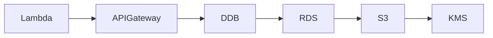

# InfraTales | AWS CDK Multi-Region Payment Infrastructure: VPC Peering, RDS, and Lambda Done Right

**CDK TypeScript reference architecture — networking pillar | advanced level**

> A fintech startup migrating real-time payment processing from Zurich (eu-central-2) to Ireland (eu-west-1) needs PCI-DSS-compliant infrastructure stood up before their cutover date — and the team is reaching for CDK TypeScript to codify it. The pain is real: cross-region VPC peering, KMS-encrypted RDS, S3 replication, and CloudWatch alarms all in one stack means one wrong IAM policy or missing subnet group and the deployment fails silently in prod at 3am. Getting multi-region payment infrastructure right in CDK without a working reference is genuinely hard.

[](LICENSE)
[](CONTRIBUTING.md)
[](https://aws.amazon.com/)
[](https://aws.amazon.com/cdk/)
[](https://infratales.com/p/32f0c86c-bd03-4e53-a520-259c3269a994/)
[](https://infratales.com)


## 📋 Table of Contents

- [Overview](#-overview)
- [Architecture](#-architecture)
- [Key Design Decisions](#-key-design-decisions)
- [Getting Started](#-getting-started)
- [Deployment](#-deployment)
- [Docs](#-docs)
- [Full Guide](#-full-guide-on-infratales)
- [License](#-license)

---

## 🎯 Overview

The stack deploys two VPCs — 10.0.0.0/16 in eu-central-2 and 10.1.0.0/16 in eu-west-1 — peered for cross-region connectivity [from-code], each with public subnets hosting NAT Gateways and private subnets isolating compute and data [from-code]. In eu-west-1, an API Gateway HTTP API routes POST /payment calls to a Node.js 20.x Lambda running inside the VPC, which writes to both a KMS-encrypted RDS PostgreSQL 17.4 Multi-AZ instance and a DynamoDB table with pay-per-request billing and PITR enabled [from-code]. S3 buckets in both regions with versioning and cross-region replication handle payment data durability [from-code], while CloudWatch dashboards and alarms provide operational visibility across the full stack [from-code]. The non-obvious design choice is running Lambda inside the VPC — necessary for private RDS connectivity but adding cold start latency and consuming ENI capacity in the /24 private subnet that most engineers underestimate at scale [inferred].

**Pillar:** NETWORKING — part of the [InfraTales AWS Reference Architecture series](https://infratales.com).
**Target audience:** advanced cloud and DevOps engineers building production AWS infrastructure.

---

## 🏗️ Architecture



> 📐 See [`diagrams/`](diagrams/) for full architecture, sequence, and data flow diagrams.

> Architecture diagrams in [`diagrams/`](diagrams/) show the full service topology (architecture, sequence, and data flow).
> The [`docs/architecture.md`](docs/architecture.md) file covers component responsibilities and data flow.

---

## 🔑 Key Design Decisions

- Lambda inside VPC adds 500ms–1s cold start penalty on first invocation [inferred] — for a payment API where p99 matters, this is a separate concern from Provisioned Concurrency cost (~$40–80/month per 10 units [editorial]); treat them as two distinct decisions: whether to accept cold starts, and whether to pay to eliminate them
- Two NAT Gateways (one per region) at ~$32/month each plus $0.045/GB data processing means cross-region Lambda egress through NAT is a quiet cost leak that only surfaces when transaction volume spikes [inferred]
- VPC peering with manual route table entries across two regions has no built-in failover — if the peering connection drops, there is no automatic reroute and the ops runbook must cover this explicitly [inferred]
- Pay-per-request DynamoDB billing is correct for unpredictable fintech traffic but provisioned capacity becomes cheaper at roughly 200+ sustained WCU — a threshold a growing payment startup can hit within months [editorial]
- RDS PostgreSQL Multi-AZ in eu-west-1 adds ~$150–200/month over single-AZ for the standby instance, but failover is automatic within 60–120 seconds — for PCI-DSS audit purposes under Requirement 12.3, this is non-negotiable [inferred]

> For the full reasoning behind each decision — cost models, alternatives considered, and what breaks at scale — see the **[Full Guide on InfraTales](https://infratales.com/p/32f0c86c-bd03-4e53-a520-259c3269a994/)**.

---

## 🚀 Getting Started

### Prerequisites

```bash
node >= 18
npm >= 9
aws-cdk >= 2.x
AWS CLI configured with appropriate permissions
```

### Install

```bash
git clone https://github.com/InfraTales/<repo-name>.git
cd <repo-name>
npm install
```

### Bootstrap (first time per account/region)

```bash
cdk bootstrap aws://YOUR_ACCOUNT_ID/YOUR_REGION
```

---

## 📦 Deployment

```bash
# Review what will be created
cdk diff --context env=dev

# Deploy to dev
cdk deploy --context env=dev

# Deploy to production (requires broadening approval)
cdk deploy --context env=prod --require-approval broadening
```

> ⚠️ Always run `cdk diff` before deploying to production. Review all IAM and security group changes.

---

## 📂 Docs

| Document | Description |
|---|---|
| [Architecture](docs/architecture.md) | System design, component responsibilities, data flow |
| [Runbook](docs/runbook.md) | Operational runbook for on-call engineers |
| [Cost Model](docs/cost.md) | Cost breakdown by component and environment (₹) |
| [Security](docs/security.md) | Security controls, IAM boundaries, compliance notes |
| [Troubleshooting](docs/troubleshooting.md) | Common issues and fixes |

---

## 📖 Full Guide on InfraTales

This repo contains **sanitized reference code**. The full production guide covers:

- Complete CDK TypeScript stack walkthrough with annotated code
- Step-by-step deployment sequence with validation checkpoints
- Edge cases and failure modes — what breaks in production and why
- Cost breakdown by component and environment
- Alternatives considered and the exact reasons they were ruled out
- Post-deploy validation checklist

**→ [Read the Full Production Guide on InfraTales](https://infratales.com/p/32f0c86c-bd03-4e53-a520-259c3269a994/)**

---

## 🤝 Contributing

See [CONTRIBUTING.md](CONTRIBUTING.md) for guidelines. Issues and PRs welcome.

## 🔒 Security

See [SECURITY.md](SECURITY.md) for our security policy and how to report vulnerabilities responsibly.

## 📄 License

See [LICENSE](LICENSE) for terms. Source code is provided for reference and learning.

---

<p align="center">
  Built by <a href="https://www.rahulladumor.com">Rahul Ladumor</a> | <a href="https://infratales.com">InfraTales</a> — Production AWS Architecture for Engineers Who Build Real Systems
</p>
